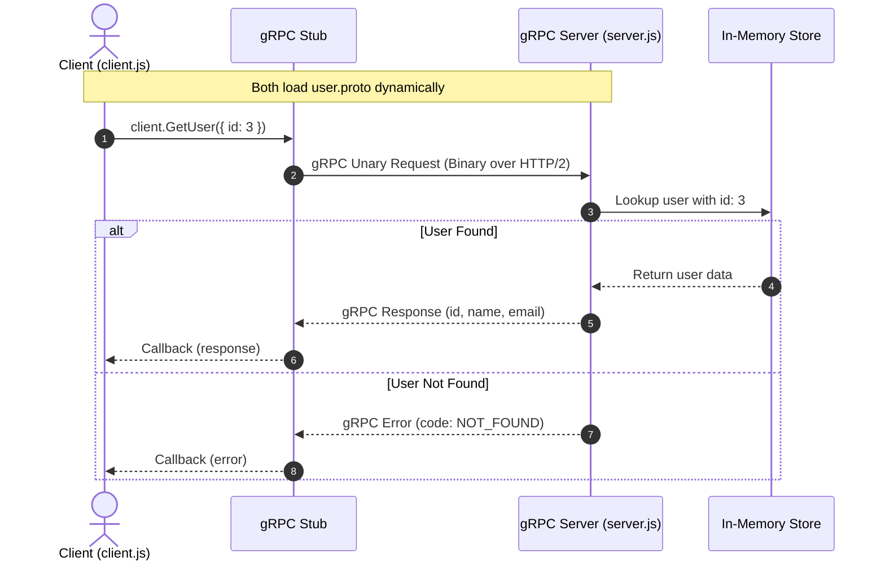

# Node.js gRPC User Service

A lightweight example of a **gRPC** service built with Node.js, demonstrating dynamic Protocol Buffer loading with `@grpc/proto-loader` and communication between a gRPC server and client using `@grpc/grpc-js`.

---

## Table of Contents

- [Overview](#overview)
- [Architecture & Workflow](#architecture--workflow)
- [Project Structure](#project-structure)
- [Protocol Buffer Definition](#protocol-buffer-definition)
- [Prerequisites](#prerequisites)
- [Installation](#installation)
- [Usage](#usage)
  - [1. Start the Server](#1-start-the-server)
  - [2. Run the Client](#2-run-the-client)
- [Configuration Note (Host & Port)](#configuration-note-host--port)
- [API Reference & Error Handling](#api-reference--error-handling)

---

## Overview

This repository demonstrates how to build and consume a unary gRPC service in Node.js without precompiling `.proto` files into static JavaScript code. The service defines a simple `UserService` that fetches user profile information by ID.

### Key Features

- **Dynamic Proto Loading**: Uses `@grpc/proto-loader` to load `.proto` definitions on runtime.
- **Unary RPC**: Implements the `GetUser` request-response pattern.
- **Error Handling**: Returns standard gRPC status codes (such as `NOT_FOUND`) when a requested resource does not exist.
- **Minimal Dependencies**: Pure JavaScript implementation using `@grpc/grpc-js`.

---

## Architecture & Workflow



---

## Project Structure

```
├── client.js             # gRPC client script that calls GetUser
├── server.js             # gRPC server implementation with in-memory data
├── user.proto            # Protocol Buffer definitions for UserService
├── package.json          # Node.js project manifest and dependencies
├── pnpm-lock.yaml        # Lockfile
└── readme.md             # Project documentation
```

---

## Protocol Buffer Definition

The schema is defined in [`user.proto`](./user.proto) using `proto3` syntax:

```protobuf
syntax = "proto3";

package user;

service UserService {
    rpc GetUser (UserRequest) returns (UserResponse);
}

message UserRequest {
    int32 id = 1;
}

message UserResponse {
    int32 id = 1;
    string name = 2;
    string email = 3;
}
```

---

## Prerequisites

- **Node.js** (v16.x or newer recommended)
- **pnpm**, **npm**, or **yarn**

---

## Installation

1. Clone this repository:
   ```bash
   git clone https://github.com/jagadheesha/gRPC.git
   cd gRPC
   ```

2. Install dependencies:
   ```bash
   # Using pnpm (recommended based on lockfile)
   pnpm install

   # Or using npm
   npm install
   ```

---

## Usage

### 1. Start the Server

Start the gRPC server:

```bash
node server.js
```

**Expected output:**
```
server running on port 50051
```

The server will listen for incoming RPC calls and log received requests.

---

### 2. Run the Client

In a separate terminal window, run the client:

```bash
node client.js
```

**Expected output:**
```
user recieved: { id: 3, name: 'Person 3', email: 'person3@example.com' }
```

And in the server terminal:
```
Received request for user with id: 3
```

---

## Configuration Note (Host & Port)

In [`server.js`](./server.js) and [`client.js`](./client.js), the server address is bound to a specific local IP (`192.168.9.114:50051`):

- **Local Machine Development**: If testing solely on `localhost`, you can update both files to use:
  ```javascript
  'localhost:50051'
  // or
  '127.0.0.1:50051'
  ```
- **Listen on all network interfaces**:
  ```javascript
  '0.0.0.0:50051'
  ```

Ensure that the host address in `client.js` matches the reachable IP/hostname of the machine running `server.js`.

---

## API Reference & Error Handling

### Mock Users Available

| ID | Name | Email |
|:---|:-----|:------|
| `1` | Jagan Dev | `jagandev@example.com` |
| `2` | Person 2 | `person2@example.com` |
| `3` | Person 3 | `person3@example.com` |
| `4` | Person 4 | `person4@example.com` |
| `5` | Person 5 | `person5@example.com` |

### Error Handling

If a requested `id` is not present in the mock data (e.g., `id: 99`):

- **Server callback**: Returns status `grpc.status.NOT_FOUND` (code `5`).
- **Client response**:
  ```
  Error: 5 NOT_FOUND: user not found
  ```

